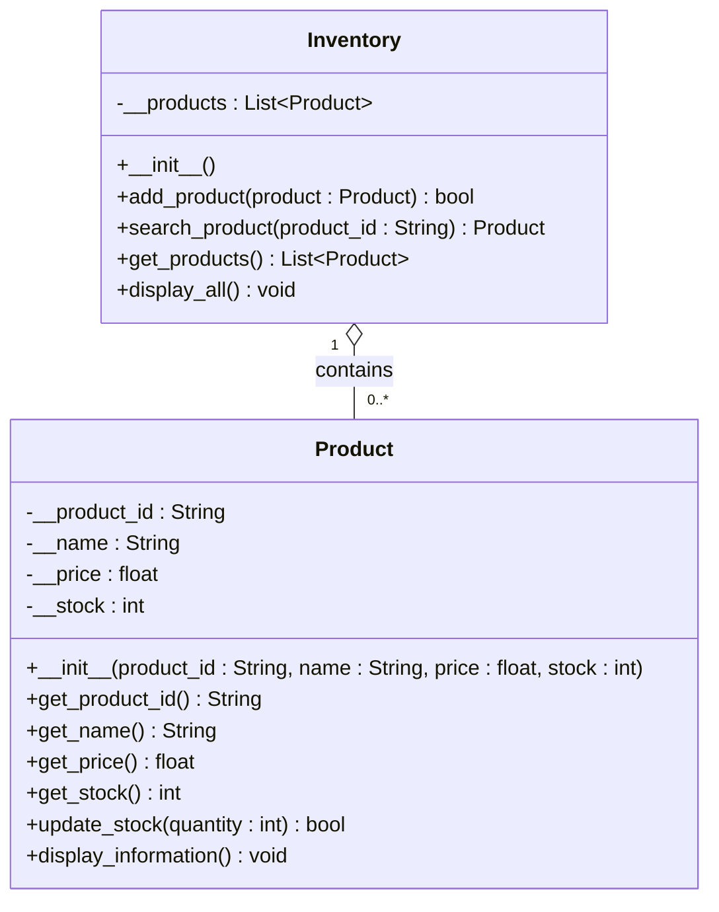

```mermaid
classDiagram
    class Product {
        -__product_id : String
        -__name : String
        -__price : float
        -__stock : int
        +#95;#95;init#95;#95;(product_id : String, name : String, price : float, stock : int)
        +get_product_id() String
        +get_name() String
        +get_price() float
        +get_stock() int
        +update_stock(quantity : int) bool
        +display_information() void
    }
    class Inventory {
        -__products : List~Product~
        +#95;#95;init#95;#95;()
        +add_product(product : Product) bool
        +search_product(product_id : String) Product
        +get_products() List~Product~
        +display_all() void
    }
    Inventory "1" o-- "0..*" Product : contains
```
